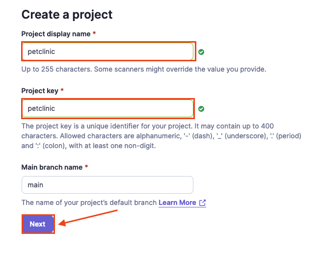
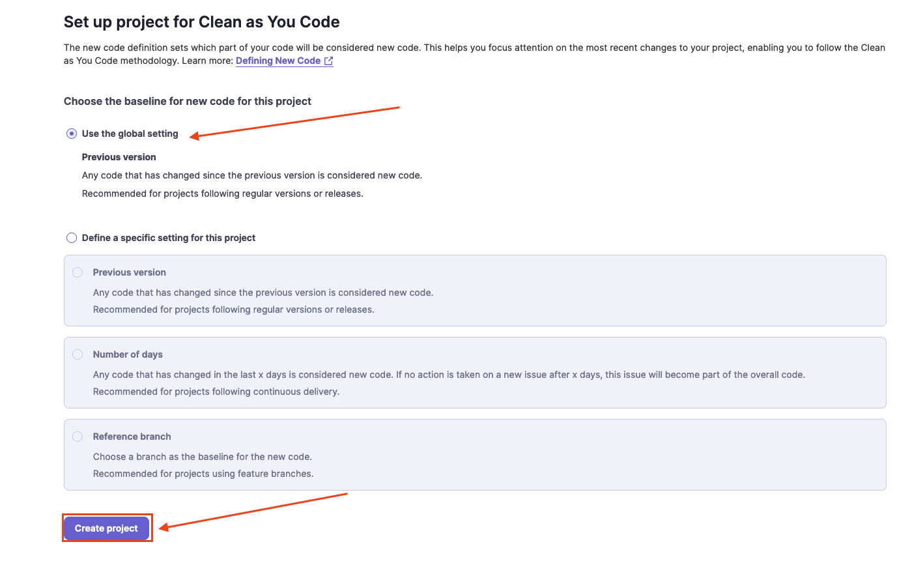
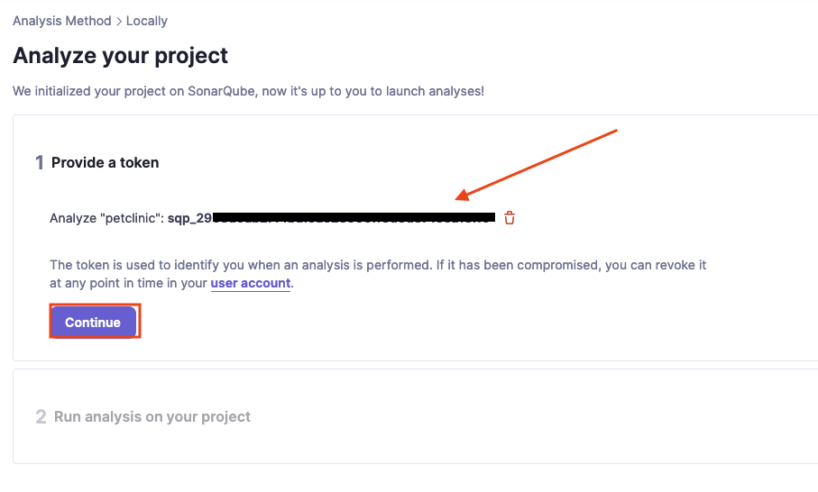
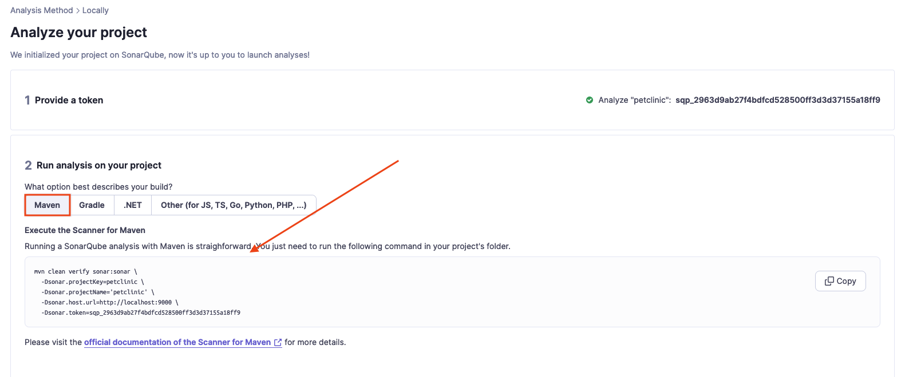
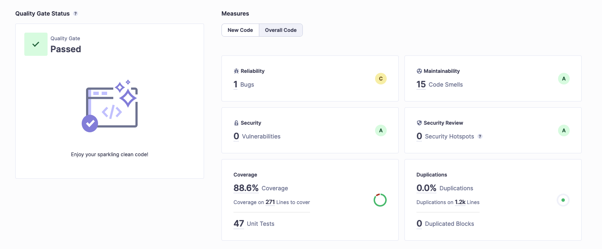

## Start k3d local cluster
```bash
k3d cluster create jenkins --api-port 6550 \
                             -p "8081:80@loadbalancer" \
                             -p "8082-8085:30082-30085@server:0" \
                             --agents 3
```
## Run code scanning with sonarqube for the petclinic java application.
### Setup environment with docker-compose
```bash
docker-compose --profile petclinic up -d
```

### Crate Sonarqube project
- Projects -> Create project manually -> fill in the form and choose **next**.


Select **Use the global settings** -> click **Create project**.


- As the *Analysis Method* select **Locally**.
- Generate token.
- Save generated token and choose **Continue**.

- Choose **Maven** and run the command provided in the code block.


- Run the sonar scanner only by removing *clean* and skip unit tests.
```bash
mvn verify -DskipTests sonar:sonar \
  -Dsonar.projectKey=petclinic \
  -Dsonar.projectName='petclinic' \
  -Dsonar.host.url=http://localhost:9000 \
  -Dsonar.token=sqp_2963d9ab27f4bdfcd528500ff3d3d37155a18ff9

# OUTPUT:
# ...
# [INFO] ANALYSIS SUCCESSFUL, you can find the results at: http://localhost:9000/dashboard?id=petclinic
# [INFO] Note that you will be able to access the updated dashboard once the server has processed the submitted analysis report
# [INFO] More about the report processing at http://localhost:9000/api/ce/task?id=AYsA09PQBP7RcWiWO5XU
# [INFO] Analysis total time: 7.384 s
# [INFO] ------------------------------------------------------------------------
# [INFO] BUILD SUCCESS
# [INFO] ------------------------------------------------------------------------
# [INFO] Total time:  58.832 s
# [INFO] Finished at: 2023-10-05T19:12:44+02:00
# [INFO] ------------------------------------------------------------------------
```
- Once scanning is done you can view the results.


## Other
### Run sonar scanner only
```bash
mvn -DskipTests verify sonar:sonar \
  -Dsonar.projectKey=petclinic \
  -Dsonar.projectName='petclinic' \
  -Dsonar.host.url=http://localhost:9000 \
  -Dsonar.token=sqp_***
```
### Run sonar scanner for other projects
```bash
export PROJECT_KEY=cicd-python-project
export AUTH_TOKEN=sqp_***
export SONARQUBE_URL=http://sonarqube:9000

docker run --net spring-petclinic_mynet  \
    --rm \
    -e SONAR_HOST_URL="${SONARQUBE_URL}" \
    -e SONAR_SCANNER_OPTS="-Dsonar.projectKey=${PROJECT_KEY}" \
    -e SONAR_TOKEN="$AUTH_TOKEN" \
    -v "$(PWD):/usr/src" \
    sonarsource/sonar-scanner-cli
```

# Reference:
- https://docs.sonarsource.com/sonarqube/latest/setup-and-upgrade/install-the-server/#example-docker-compose-configuration